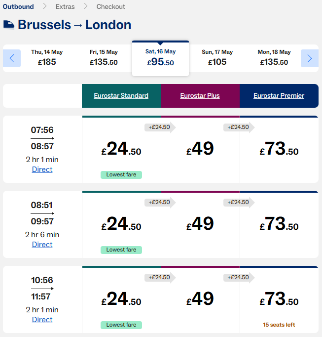

# Eurostar STAFF Prices

Bookmarklet for [eurostar.com](https://www.eurostar.com) that switches search results from public (PUB) to STAFF pricing (28€/56€/84€).

## Usage

1. Install the bookmarklet from the [installation page](https://martinlangbecker.github.io/bookmarklets/).
2. On eurostar.com, start a search (e.g. Brussels → London).
3. On the results page, click the bookmarklet → "STAFF aktiv!" alert appears.
4. Switch to a **different date** in the date bar → STAFF prices are shown.

## Notes

- The first date's results are cached by the browser. Only new API requests (= different date) are intercepted.
- To revert to public prices, reload the page (F5).
- STAFF only works on **Eurostar Blue** (London routes). Red routes show 0€.
