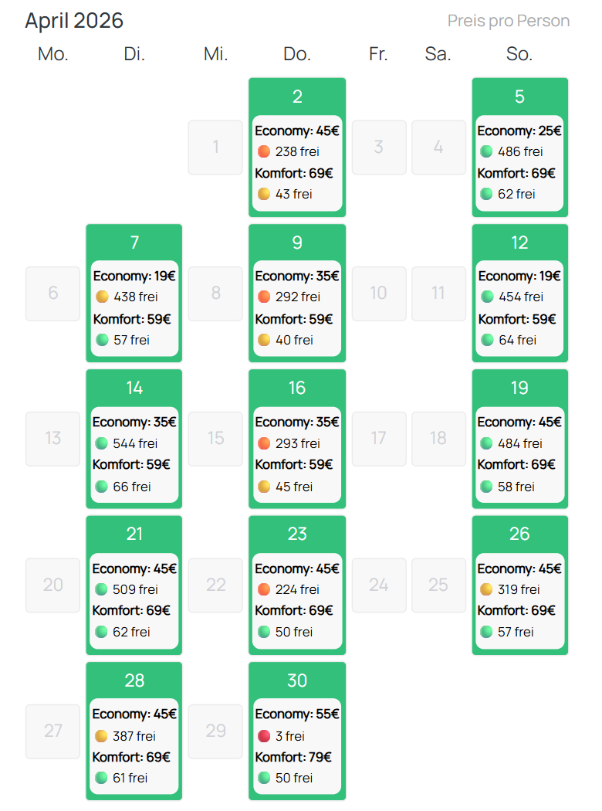

# GoVolta Availability Calendar

## Description

This bookmarklet enhances the GoVolta price calendar view by displaying base prices for both available classes and the number of available seats in each class next to a visual occupancy indicator with the following levels:

- 🟢 >75% seats available
- 🟡 >50% seats available
- 🟠 >25% seats available
- 🔴 >0 seats available
- ❌ 0 seats available

The maximum number of seats changes at an observed cutoff date (2026-09-28):

- Before: 602 Economy (7 × 86) / 66 Komfort (1 × 66, half-capacity policy)
- After: 516 Economy (6 × 86) / 132 Komfort (2 × 66, all seats sold)

Since this script works only based on data provided on the website, no requests are sent during its execution and no further functionality is provided.

## Usage

1. Go to https://govolta.nl; change language as needed.
2. In the form, select start, destination, number of passengers and single journey as desired and click on "Search".
3. Once the following page has finished loading, a price calendar should be displayed.
   1. If desired, click on "Show more" on the bottom of the page to see more dates.
4. Execute the bookmarklet.
