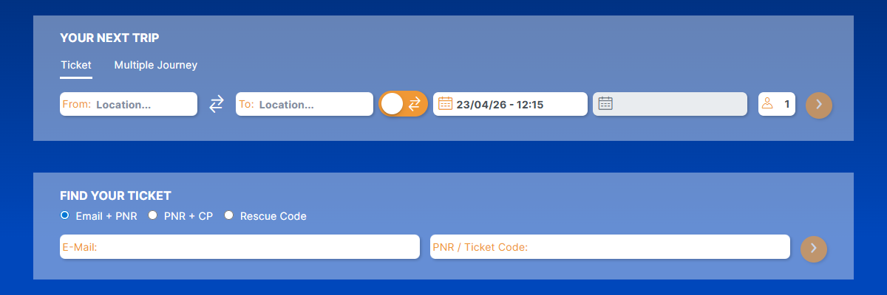

# Hellenic Train Ticket Search

## Background

When purchasing a ticket on the Hellenic Train app, the app may show:

> "The purchase was completed successfully, but an error occurred while sending the email.
> You can retrieve your ticket by accessing your customer area, or using PNR/ticket code
> and email, or PNR and CP via the 'Retrieve Ticket' function if you made the purchase
> without logging in."

This error appears regardless of whether the user is logged in or not — no confirmation
email is delivered in either case. When logged in, the ticket still appears in "My Trips"
in the app, but no PNR or recovery code is shown. When purchasing without an account,
the ticket is effectively lost.

The "Retrieve Ticket" function referenced in this message exists on the Trenitalia website
(which shares the same backend platform) but was never implemented on the Hellenic Train
website. This bookmarklet fills that gap.

## What it does

Searches for a ticket using one of three lookup methods:
- Email + PNR
- PNR + CP
- Name + Rescue code

On success, redirects to the Hellenic Train website's native trip detail page, which
supports viewing ticket details, changing connections, changing tickets, refunds, and
requesting compensation for past trips.

On failure, shows an error message.

The UI matches the Hellenic Train website's design (blue gradient background, orange
buttons, input group styling) and supports all three site languages (English, Italian,
Greek). Language is auto-detected and updates when the user switches via the site's
language picker.

## Installation

Install the bookmarklet from the [installation page](https://martinlangbecker.github.io/bookmarklets/).

## Usage

1. Go to https://newtickets.hellenictrain.gr
2. Execute the bookmarklet
3. Enter your lookup credentials and click Search
4. You will be redirected to the trip detail page

The search button is disabled until all fields for the selected mode are filled in.

## Notes

- Ticket recovery works regardless of login state: tickets purchased with or without
  an account can be retrieved whether the user is logged in or not.
- The trip detail page works for both active and canceled/refunded tickets.
- The trip detail page does not offer PDF download. PDF download is only available from
  the "My Trips" overview (which requires being logged in). Each ticket card in that
  overview has a download button. Guest purchases have no PDF download at all — the
  PDF endpoint returns empty even when the `pdfAvailable` flag is `true`.
- Management options on the detail page include "Request compensation", which becomes
  active after the trip has taken place. This makes it important to be able to retrieve
  past tickets — especially guest purchases that aren't linked to any account.
