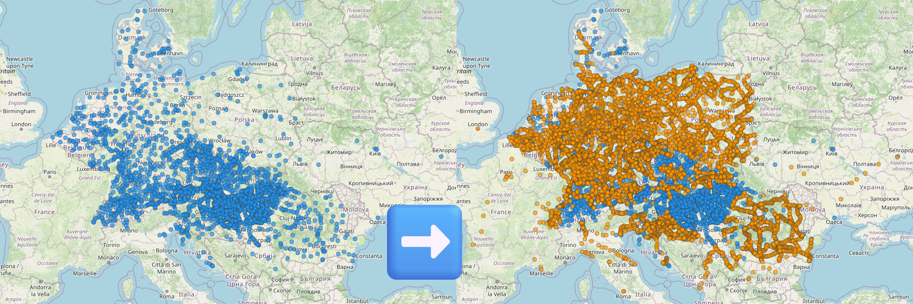

# MÁV Hidden Stations

<figure>
  
  <figcaption>Stations available for MÁV booking before (left) and after (right) applying the bookmarklet</figcaption>
</figure>

## Description

The [MÁV ticket shop](https://jegy.mav.hu/) only exposes a subset of stations through its `GetStationList` API. However, the booking API accepts many more stations — including thousands of smaller stations all across Europe that are reachable via international trains but not available in the booking UI.

This bookmarklet injects these "hidden" stations into the station picker by patching the cached station list in the browser's CacheStorage. After injection, you can search for and book tickets to/from stations that MÁV doesn't officially list.

## Installation

Install the bookmarklet from the [installation page](https://martinlangbecker.github.io/bookmarklets/).

## Usage

1. Visit https://jegy.mav.hu and perform at least one search (so the station list gets cached).
2. Click the bookmarklet. An alert will confirm how many stations were injected.
3. Reload the page. The hidden stations are now available in the station picker.

## How it works

The MÁV frontend caches the station list response in the browser's CacheStorage (under a key starting with `JE_IK_FE`). The script:

1. Opens the CacheStorage and finds the cached `GetStationList` response.
2. Filters out stations that are already in the cached list.
3. Appends the new stations and writes the modified response back to the cache.

The bookmarklet has all discovered stations inlined (~258KB) — no external requests are made.

On the next page load, the frontend reads the patched cache and all injected stations become searchable.

## Notes

- The injection is **temporary** — clearing the browser cache or the site's CacheStorage will remove the injected stations.
- Not all injected stations support ticket purchases. Some may only work for timetable queries.
- The inlined station list originates from [`mav-stations`](https://github.com/martinlangbecker/mav-stations) and is updated periodically when new stations are added there.

## Related

- [`mav-prices`](https://github.com/martinlangbecker/mav-prices) — JavaScript module for querying MÁV international ticket prices.
- [`mav-stations`](https://github.com/martinlangbecker/mav-stations) — The official MÁV station list as an npm package.
